### WEB SOLUTION WITH WORDPRESS

Launched and configured two ec2 instances 

NB: *The OS for this project is RedHat*

Created 3 volumes in the same AZ as the Web Server EC2, each of 10 GiB. and attached each volumes to the Web server EC2 instance.

To check if the block devices has been successfully attached to the server the command below was used after connecting to web server ec2 instance from terminal. 

```
lsblk
```

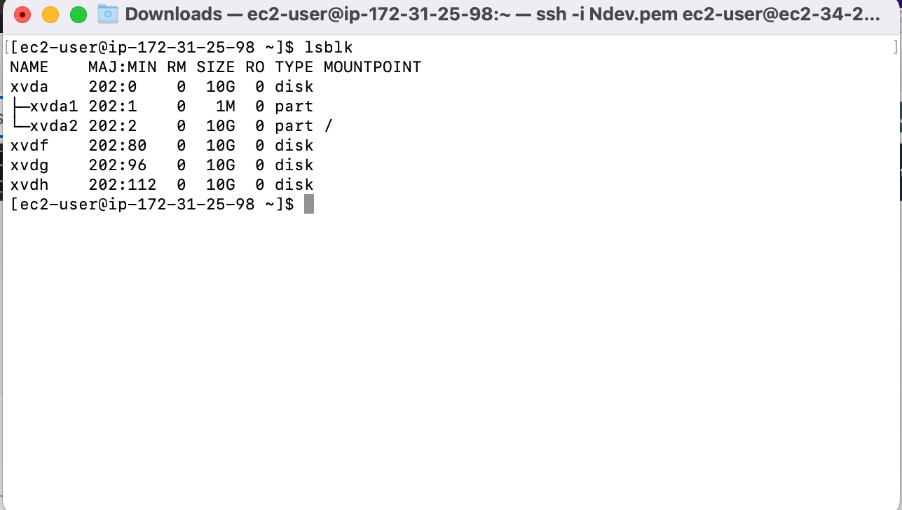

*the image above shows that the block devices are attached to the server*

Creating partition for each disk
Created a single partition on each of the 3 disks with the command below. 

```
sudo gdisk /dev/xvdf 
sudo gdisk /dev/xvdg 
sudo gdisk /dev/xvdh
```

- for the first disk xvdf:

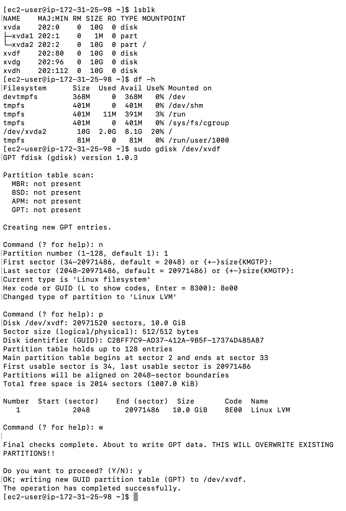

- for the second disk xvdg:

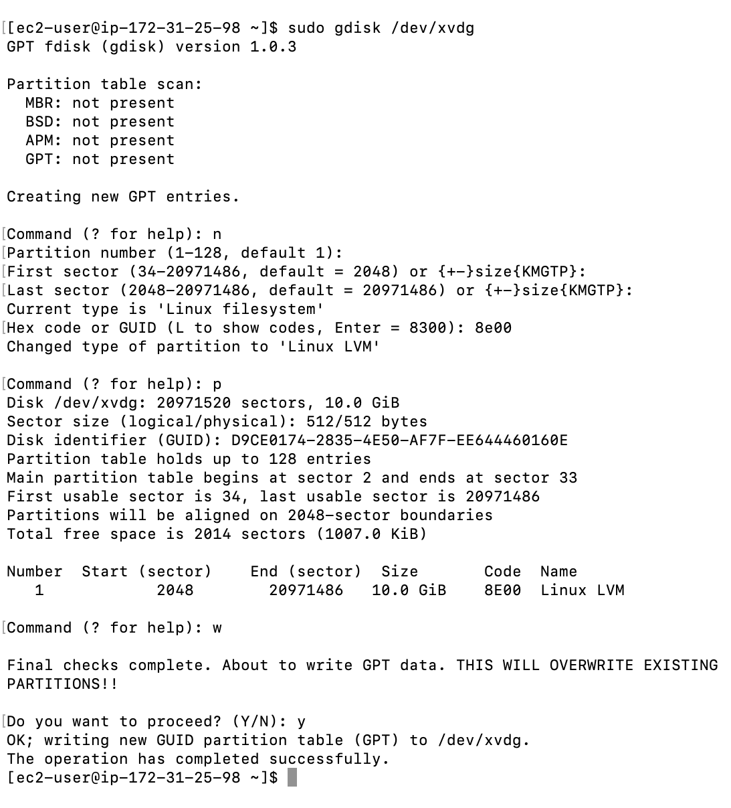

- for the third disk xvdh:

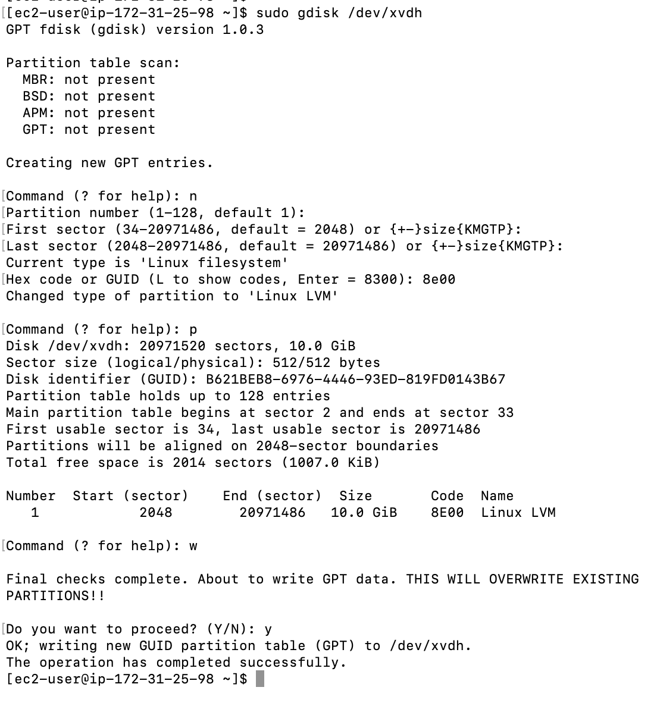

The image below shows that the partitions were succesfully configured:

Used 
```
lsblk
```
 utility to view the newly configured partition on each of the 3 disks

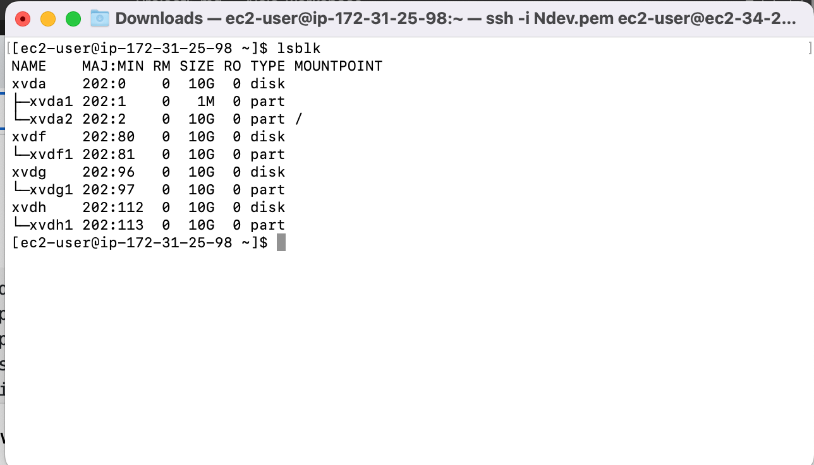


### Installation of LVM package

```
sudo yum install lvm2 -y
```

To check for available partition

```
sudo lvmdiskscan
```

next

Used pvcreate utility to mark each of the 3 disks as physical volumes (PVs) to be used by LVM

```
sudo pvcreate /dev/xvdf1 /dev/xvdg1 /dev/xvdh1
```

used the code below to verify that the physical volume has been  created succesfully

```
sudo pvs
```
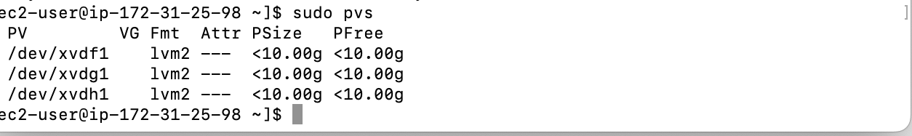

next

Used vgcreate utility to add all 3 PVs to a volume group (VG), and named the VG webdata-vg

```
sudo vgcreate webdata-vg /dev/xvdh1 /dev/xvdg1 /dev/xvdf1
```

```
sudo vgs
```

to check and confirm that the VG has been created successfully.

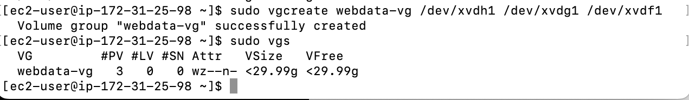

next

Created 2 logical volumes using lvcreate utility. for apps-lv (Used half of the PV size), and for logs-lv Used the remaining space of the PV size.

```
sudo lvcreate -n apps-lv -L 14G webdata-vg
sudo lvcreate -n logs-lv -L 14G webdata-vg
```

```
sudo lvs
``` 
to confirm that the logical volume has been succesfully  created

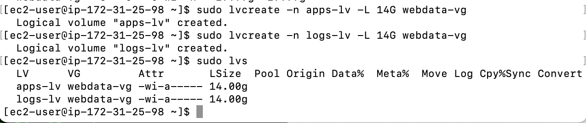

next

Used mkfs.ext4 to format the logical volumes with ext4 filesystem

```
sudo mkfs -t ext4 /dev/webdata-vg/apps-lv

sudo mkfs -t ext4 /dev/webdata-vg/logs-lv
```

next

Created /var/www/html directory to store website files

```
sudo mkdir -p /var/www/html
```

Created /home/recovery/logs to store backup of log data

```
sudo mkdir -p /home/recovery/logs
```

next

the code below was used  to mount  /var/www/html on apps-lv logical volume


```
sudo mount /dev/webdata-vg/apps-lv /var/www/html/
```

next

Now before mounting /var/log on logs-lv rsync utility was used  to backup all the files in the log directory /var/log into /home/recovery/logs

```
sudo rsync -av /var/log/. /home/recovery/logs/
```

hence mount /var/log on logs-lv logical volume 

```
sudo mount /dev/webdata-vg/logs-lv /var/log
```

Restored log files back into /var/log directory

```
sudo rsync -av /home/recovery/logs/. /var/log
```

next

Updated /etc/fstab file so that the mount configuration will persist after restart of the server.

to update the /etc/fstab file the UUID of the device was used

to extract the UUID of the device 

```
sudo blkid
```

```
sudo vi /etc/fstab
```


tested the configuration and restarted the daemon

```
 sudo mount -a
```

```
sudo systemctl daemon-reload
```


next

### The DataBase  Server

Created 3 volumes in the same AZ as the DB Server EC2, each of 10 GiB. and attached each volumes to the DB server EC2 instance.

carried out the same steps as for the Web Server, but instead of apps-lv created db-lv and mounted it to /db directory instead of /var/www/html/.


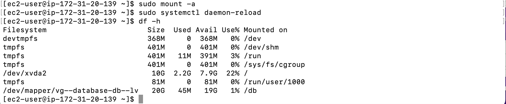

*The image above shows that the database setup was successful*

next

### Word press Installation on web server EC2 

to update the  repository
```
sudo yum -y update
```


to Install wget, Apache and it’s dependencies
```
sudo yum -y install wget httpd php php-mysqlnd php-fpm php-json
```

Start Apache
```
sudo systemctl enable httpd
sudo systemctl start httpd
```

To install PHP and it’s dependencies

```
sudo yum install https://dl.fedoraproject.org/pub/epel/epel-release-latest-8.noarch.rpm

sudo yum install yum-utils http://rpms.remirepo.net/enterprise/remi-release-8.rpm

sudo yum module list php

sudo yum module reset php

sudo yum module enable php:remi-7.4

sudo yum install php php-opcache 
php-gd php-curl php-mysqlnd

sudo systemctl start php-fpm

sudo systemctl enable php-fpm

sudo setsebool -P httpd_execmem 1
```

Restart Apache

```
sudo systemctl restart httpd
```

Download wordpress and copy wordpress to var/www/html

```
  mkdir wordpress
  
  cd   wordpress
  
  sudo wget http://wordpress.org/latest.tar.gz
  
  sudo tar xzvf latest.tar.gz
  
  sudo rm -rf latest.tar.gz
  
  sudo cp wordpress/wp-config-sample.php wordpress/wp-config.php
  
  sudo cp -R wordpress /var/www/html/
```


Configure SELinux Policies

```
  sudo chown -R apache:apache /var/www/html/wordpress
  
  sudo chcon -t httpd_sys_rw_content_t /var/www/html/wordpress -R
  
  sudo setsebool -P httpd_can_network_connect=1
  
  sudo setsebool -P httpd_can_network_connect_db 1
  ```

  next

  mysql installation on DB server EC2

  ```
  sudo yum install mysql-server
  ```

  started and enabled the mysql server

  ```
  sudo systemctl start mysqld

  sudo systemctl enable mysqld
  ```

  The command below was used to configure the DB to  work with  wordpress
  
  ```
sudo mysql -u  root -p

CREATE DATABASE wordpress;

CREATE USER `wordpress`@`%` IDENTIFIED BY 'password';

GRANT ALL ON wordpress.* TO 'wordpress'@'172.31.15.79';

FLUSH PRIVILEGES;

SHOW DATABASES;

exit
```
next

set the  bind address

```
sudo  vi /etc/my.cnf
```

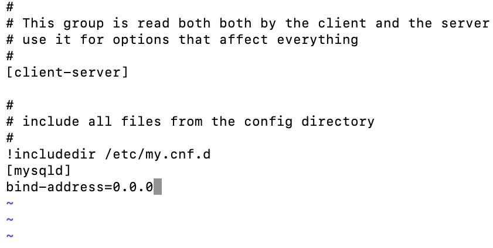

```
sudo systemctl restart mysqld
```

Installed MySQL client and tested that i can connect from the Web Server to the DB server by using mysql-client

```
sudo yum install mysql
sudo mysql -h 172.31.20.139 -u wordpress -p
```

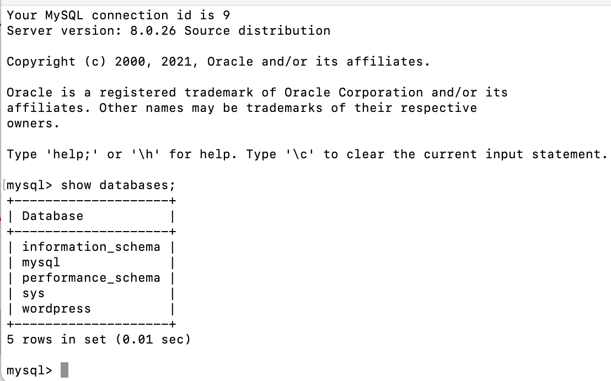

*the image above shows the List of existing database in the DB server accessed from the webserver which implies that the Webserver EC2 can communicate with Database EC2*

Enabled TCP port 80 in Inbound Rules configuration for your Web Server EC2 (enable from everywhere 0.0.0.0/0 or from your workstation’s IP)

Then i accessed the link to my wordpress from my browser

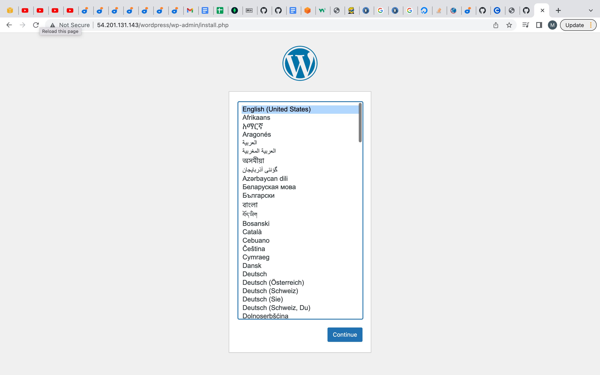

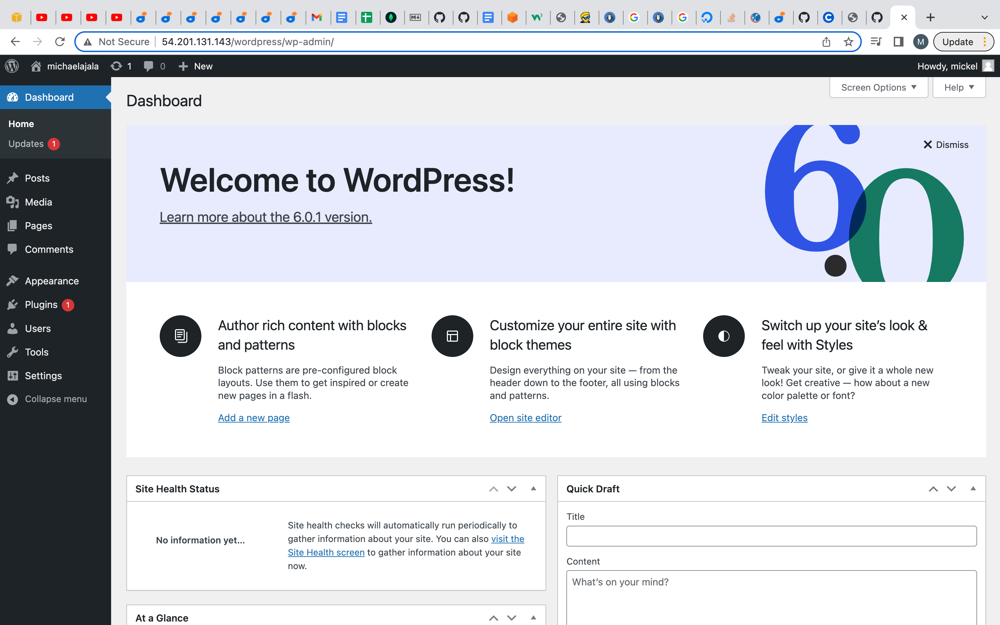